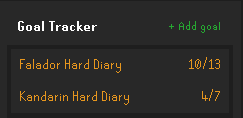
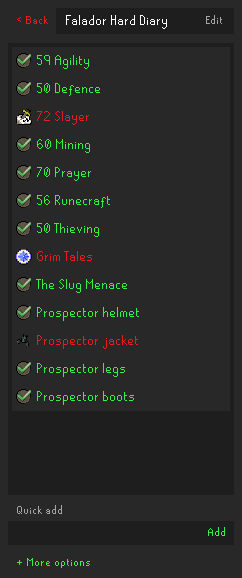
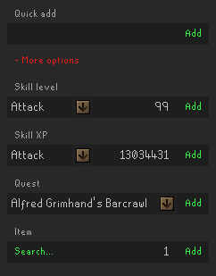

# Runelite Goal Tracker Plugin

Keep track of your OSRS goals and complete them automatically.

## Features

- Track different types of tasks
    - Manual tasks
    - Skill tasks
    - Quests
    - Item tasks
- Organise tasks lists into goals
- Reorder and manage goal and task lists
- Chat notification on task completion

### Planned

- More task types
    - Achievement diaries
    - Minigame rewards
    - Kourend favour
    - NPC kills

Suggestions are welcome - please submit an issue :)

## Usage

### Goals

Goals are lists of tasks, and at a glance provide a quick way to view your progress towards the goal.

You can add a new goal with the "+ Add goal" button, and you can reorder/remove goals using right click. Clicking a goal will show the tasks within:

From here, you can add tasks to the goal.

### Adding tasks

#### Manual tasks

Basically a simple to-do list item. You can add these via the "Quick add" text box.

You can toggle them on and off manually just by clicking them.

Use the "+ More options" button to reveal the automatic task options.

#### Skill level/XP tasks

Use these tasks to automatically track skill progress. Just select a skill, and the desired level or XP amount. The task will automatically complete once you hit that level/xp.

#### Quest tasks

Track quest progress and completion, just select a quest or miniquest from the dropdown. Will also display in progress quests as orange.

#### Item tasks

Select an item using the search button and searching via the in-game chatbox, then set the desired quantity. The plugin will keep track of your items and tally up quantities stored in different inventories (bank, player, GIMP storage), and will be automatically completed once you get that amount of the item.
